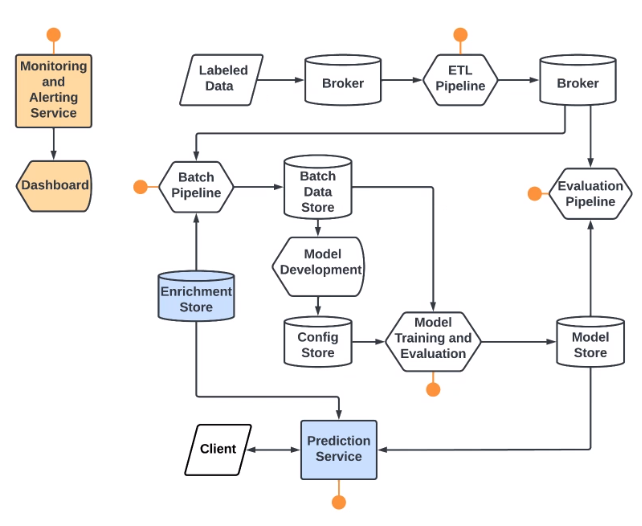

# Home Price Prediction System
Nicholas Kaja, Hamza Zuberi

## Overview
This project involves an end-to-end machine learning production system that continuously ingests, cleans, and batches incoming data to train and evaluate models whose architecture and hyperparameters are defined in a configuration chosen during offline model development. Newly trained models are continuously evaluated, and the performance metrics are sent to a monitoring service.

This system involves multiple stages and components, each comprising their own Docker container:  
1. `etl-pipeline` Uses ByteWax for stream-processing live data. Incoming records are cleaned and a MongoDB instance holding enrichment data is used to provide additional fields. Records are sent to a Kafka topic.
2. `batch-pipeline` Periodically takes data from the Kafka source topic and stores it as a batch in a MinIO object store.
3. `batch-training-pipeline` Periodically grabs the most recent batch of data and model configuration from the MinIO object store and trains a new model.
4. `evaluation-pipeline` Takes the most recently trained model and evaluates it on fresh data from the Kafka source topic. Performance metrics are sent to the Prometheus monitoring service.
5. `prometheus` Runs the Prometheus monitoring service, which tracks model evaluation metrics as time-series data. Useful for tracking system resource usage as well as detecting errors and data drift.
6. `prediction-service` Serves a Flask API which receives and cleans data records then returns the model prediction.

## Architecture Diagram:  
